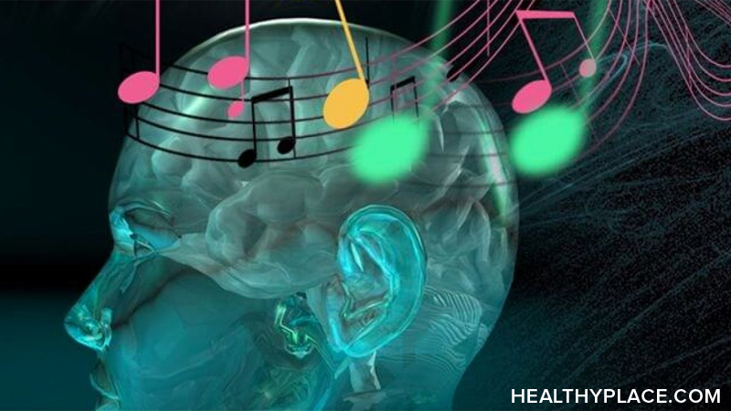
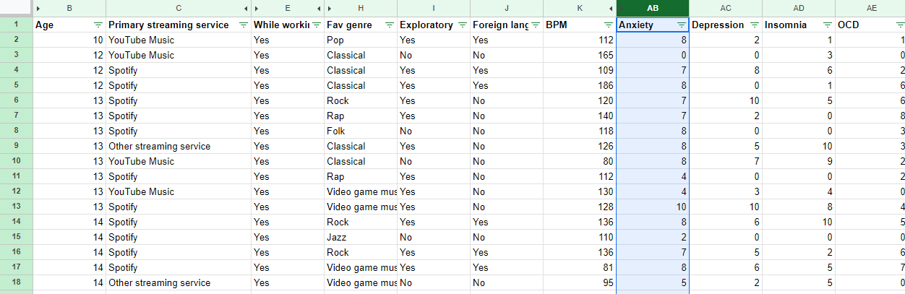
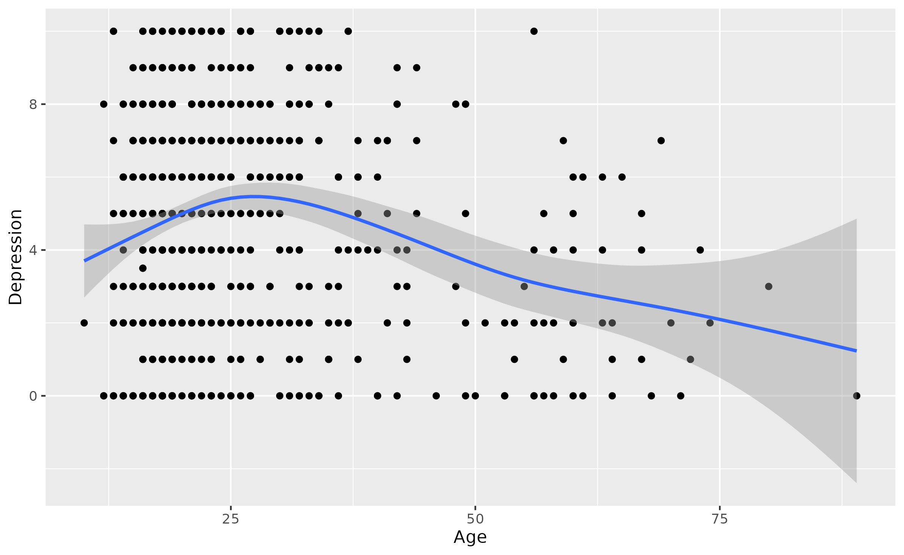
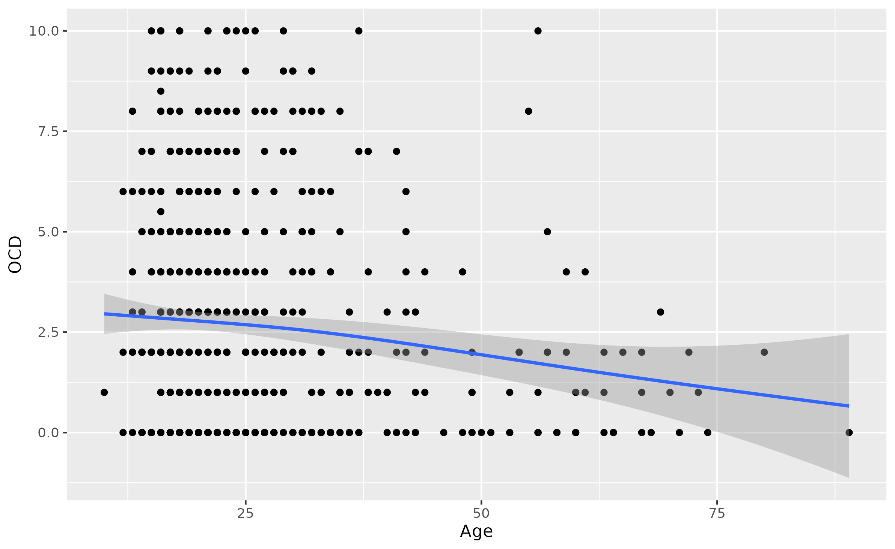
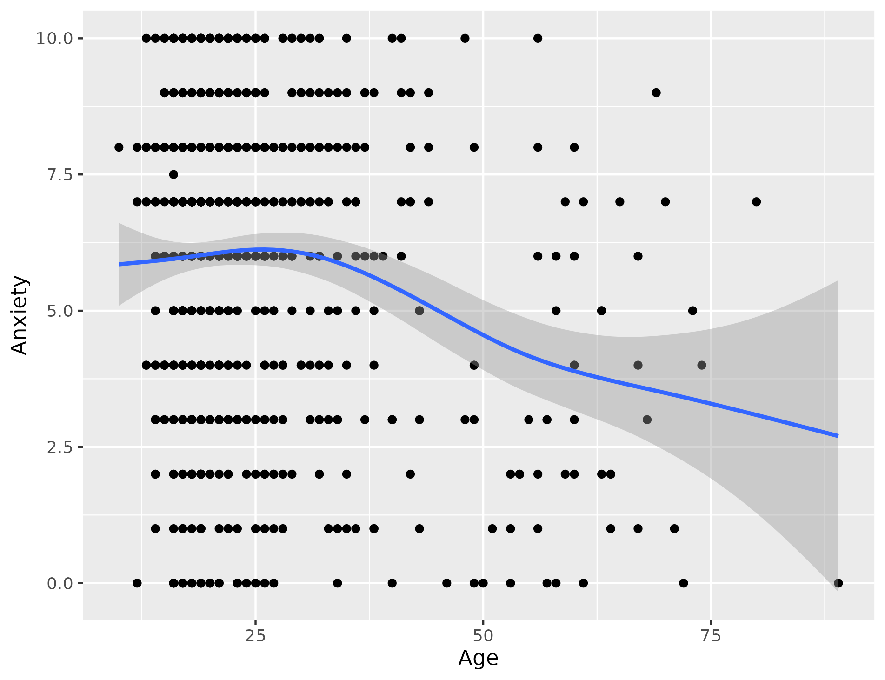

# Music vs Mental Health
## Music Therapy

As we face challenges in our day-to-day life our emotions can also alter. According to research from the U.S. Census Bureau Household Pulse Survey about one-third of adults are to have both anxiety and depression (Forbes). In this article, we will discover the correlation between mental health and how music can play a role in decreasing the number of such disorders.

The information provided is found on a well-known data platform named Kaggle. The dataset used to collect the information is "Music & Mental Health Survey Results", this article provides meaningful information about demographics, multiple disorders studied, favorite genres listened to, streaming services, and music effects. The data was analyzed using Spreadsheet, Tableau, and R Programming. 

The dataset compares ages from early teens to geriatric, who suffer from either insomnia, anxiety, depression, or OCD. It also shows the different types of genres that were reported as their favorite. The information previewed will show the sum of all ages when compared to the different mental disorders and music listened to. I first started by integrating the data from Kaggle to Google spreadsheets. I then filtered out which rows were most relevant to use. I wanted to know which streaming service was mostly used so I used "Chart" in the insert tab, which created a pie chart. Spotify was the most used.

The younger generation displays more of a mental disorder. According to the National Institute of Mental Health, young adults have had the highest prevalence of SMI 11.4%. Research shows that mental illnesses start at a young age and can be hard to see by others. Shown below I used R programming to visualize which age is most affected by mental illness. 

Rock music was the preferred choice to listen to, but there are other ways to use music as a coping mechanism. Some may use instruments to soothe the mind. A study on "Psychiatry.org" suggests that music engagement not only shapes our personal and cultural identities but also plays a role in mood regulation. Research also reports that involving in music-making activities, such as using musical instruments and, singing in groups, can facilitate emotional release and promote self-reflection.

In conclusion, with the help of a qualified music therapist also known as "MA" music can be a nonmedicinal way of decreasing or maintaining stress, whether it be anxiety, depression, or insomnia. By playing your favorite song or picking up a hobby of learning an instrument these are just a few ways to cope with mental illnesses. 

###### *Some charts are missing from this project, will add them as soon as possible*

